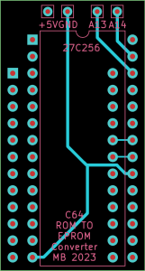
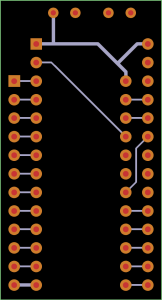

# Commodore 64 Kernal Replacement Project

## Description

Simple and compact PCB to replace the C64 Kernal (this is how Commodore spell Kernel) ROM with a 27C256 with the original ROM dump and 3 additional alternative ROMs.

## Development

The project is constructed in Kicad. The output files are generated in Gerber format.

## Design

The PCB replaces the Kernal ROM. The PCB plugs in to the Kernal ROM socket. Two switches or a rotary switch may be used to switch between the alternative ROMs.

## EPROM Configuration

The EPROM is segmented as follows:

- 0k-8k Original Kernal ROM (bank 1) Address line 13 LOW; Address line 14 LOW
- 8k-16k Jiffy DOS (bank 2) Address line 13 HIGH; Address line 14 LOW
- 16k-24k Cockroach Turbo ROM [nostalgia reasons] (bank 3) Address line 13 LOW; Address line 14 HIGH
- 24k-32k Dolphin DOS (bank 4) Address line 13 HIGH; Address line 14 HIGH

The ROM configuration I have used is as follows:

- 0k-8k kernal.901227-03
- 8k-16k JiffyDOS_C64
- 16k-24k cockroach_turbo_rom
- 24k-32k dolphin_dos-30

A switch is connected between +5v and address lines 13 adn 14.

## Part List & Build Instructions

2 x 20 contact (only need 12 contact by 20 is more common) Board-to-Board through hole straight pin headers.
For example <https://au.element14.com/amp-te-connectivity/2-826629-0/btb-conn-header-20pos-1row-2-54mm/dp/1580047>
These are soldered to the 2 rows of 12 through-holes on the underside of the board and are used to plug in to the Kernal ROM socket.
Solder these first.

1 x 28 contact DIP 2.5mm x 15.24mm socket. The socket should slightly stand off the board to not interfere with the pin headers.
For example <https://au.element14.com/multicomp/2227mc-28-06-07-f1/socket-ic-dil-0-6-28way/dp/1103852>
This soldered to the topside of the PCB for mounting the 27C256.

1 x 4 position, minimum 2 pole rotary switch or 2 x single throw double miniature toggle switches
For example <https://au.mouser.com/ProductDetail/Alpha-Taiwan/SR2511F-0304-19R0B-E9-N-W-159> OR
<https://au.element14.com/e-switch/100sp1t1b1m1qeh/toggle-switch-spdt-5a-120vac-28vdc/dp/2522278>

1 x 27C256 EPROM (or compatible - eg AT28C256 will also work)
I've used a write once compatible EPROM here.

## Rotary Switch Wiring

If a 4 position rotary switch is used, it is wired as follows:
- Pole A: connected to address line 13
- Pole B: connected to address line 14
- Pins 1, 3, 5 and 6 connected to GND
- Pins 2, 4, 7 and 8 connected to +5V

This should result in the following truth table:
Pos | A13 | A14 | Why
--- | --- | --- | ---
1 | L | L | Pin 1 (Pole A Way 1) Low, Pin 5 (Pole B Way 1) Low
2 | H | L | Pin 2 (Pole A Way 2) High, Pin 6 (Pole B Way 2) Low
3 | L | H | Pin 3 (Pole A Way 3) Low, Pin 7 (Pole B Way 3) High
4 | H | H | Pin 4 (Pole A Way 4) High, Pin 8 (Pole B Way 4) High

## Double Pole Switch Wiring

If using two single throw double pole switches, wire as follows:
- Switch 1: Center pin to address line 13, top pin to GND, bottom pin to +5V.
- Switch 2: Center pin to address line 14, top pin to GND, bottom pin to +5V.
